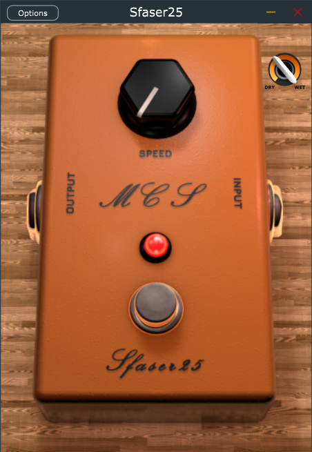

# Sfaser25
## Wave Digital Filter (WDF) Virtual Analog Model of the MXR Phase90 



### Music And Acoustic Engineering Capstone Course Project - Politecnico Di Milano

<p float = "center">
    
    
</p>

### Authors
* [Samuele Del Moro](https://github.com/SamueleDelMoro)
* [Claudio Eutizi](https://github.com/claudioeutizi)
* [Mattia Massimi](https://github.com/mattiamassimi)
### Abstract
In this project we focus on the analysis and modeling of one of the most famous electric guitar effect pedal, the phaser MXR Phase 90. We exploit the Wave Digital Filter white-box method in order to create the physical model of the device, mainly focusing on the implementation of the operational amplifiers using nullors and on the description of a novel non-iterative explicit approach to implement the non-linear behavior of the Junction Field Effect Transistors (JFETs) as voltage-controlled resistors. To validate the proposed physical model, both a MATLAB implementation and a real-time audio plug-in JUCE Framework have been developed and compared with the LTSpice reference circuit.
### Installation
The **BUILDS** folder contains both a .exe standalone version and a .vst3 version of our project. In order to build the entire project, it is recommended to
* clone the repository:
```
git clone https://github.com/claudioeutizi/Sfaser25.git
```
* install [JUCE](https://juce.com/get-juce/) and open the _/JUCE/Sfaser25.jucer_ file with Projucer. Choose an IDE e.g., [Visual Studio](https://visualstudio.microsoft.com/it/), [XCode](https://apps.apple.com/it/app/xcode/id497799835?mt=12) exporter and click on **Save and Open with IDE** (the button on the right of the selected exporter).
* Build the entire solution using the chosen IDE.

### Folder Organization
#### BUILDS
This folder contains the executables, both for standalone and VST3 usage. 
#### JUCE
Here the JUCE/C++ implementation of the project can be found. The [Eigen C++ library](http://eigen.tuxfamily.org/index.php?title=Main_Page#Download) is needed in order to work with linear algebra. The folder "Sfaser25" contains:
* Sfaser25.jucer file that can be opened with Projucer.
* **GUI** folder contains knob, LED and buttons' stripes and the [Cinema4D](https://www.maxon.net/it/cinema-4d) project with which the plugin GUI has been designed.
* **JuceLibraryCode** contains the files that JUCE needs in order to build the project.
#### MATLAB
The folder contains the 3 stages implementation and the main with some output files. The two sub-folder contain the matlab scripts and the files used to create the plots that can be seen in the report
#### SPICE
SPICE folder has the "cmp" sub-folder with the LTSpice models of the transistors used and the "datasheet" sub-folder with some useful datasheets. Then, we can find the spice circuits for a single stage, the ideal circuit with resistors instead of JFETs, the ideal circuit with JFETs and the real circuit (with non-ideal op-amps)

